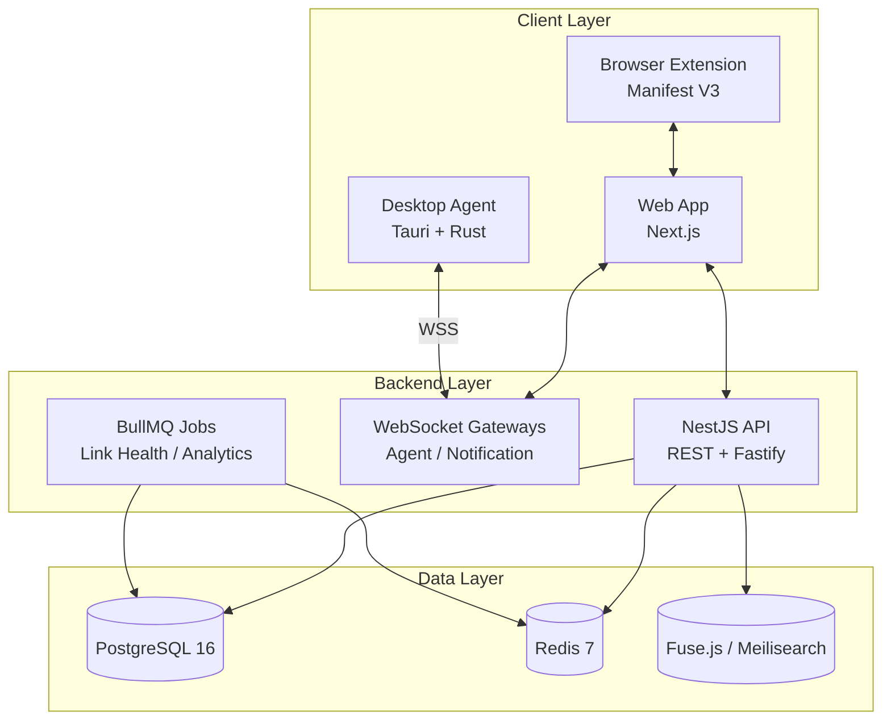

# DevFlow Hub

<p align="center">
  <strong>Developer Workspace Management Platform</strong><br/>
  Biến 15 phút setup ngữ cảnh thành <strong>10 giây</strong> — Một click mở toàn bộ tài nguyên của dự án.
</p>

<p align="center">
  <a href="#-quick-start">Quick Start</a> ·
  <a href="#-kiến-trúc-tổng-quan">Architecture</a> ·
  <a href="#-cấu-trúc-monorepo">Structure</a> ·
  <a href="#-tech-stack">Tech Stack</a> ·
  <a href="#-lộ-trình-phát-triển">Roadmap</a>
</p>

---

## Vấn đề

Một developer phải tương tác với **hàng chục tài nguyên phân tán** mỗi ngày — GitHub, Figma, Swagger, pgAdmin, source folders, Docker, Postman — không có mối liên kết ngữ cảnh. Kết quả:

| Pain                                              | Hệ quả                                             |
| ------------------------------------------------- | -------------------------------------------------- |
| Tài nguyên liên quan cùng dự án phân tán khắp nơi | Mất 5–15 phút setup mỗi lần switch dự án           |
| Tab hoarding (30–50+ tabs mở cùng lúc)            | Browser lag, cognitive overload                    |
| Không có cách "bảo tồn" session làm việc          | Không dám đóng tab, onboarding new member mất ngày |

**DevFlow Hub** giải quyết bài toán này bằng cách gom nhóm tài nguyên theo **ngữ cảnh dự án** và khởi động tức thì bằng một thao tác duy nhất.

---

## Tính năng chính

| Module                   | Tính năng                                              | Mô tả                                                                             |
| ------------------------ | ------------------------------------------------------ | --------------------------------------------------------------------------------- |
| **Workspace Management** | CRUD, Tags, Drag & Drop, Color Coding                  | Tổ chức workspaces theo dự án, resource N–N reuse, sắp xếp linh hoạt              |
| **Launch Engine**        | One-click Launch, Selective Launch, Throttling         | Mở web URLs + local folders đồng thời; batch open khi >15 tabs; anti-spam 5s lock |
| **Smart Access**         | Command Palette (`Ctrl+K`), Fuzzy Search, Keyboard Nav | `cmdk` + Fuse.js, tìm kiếm realtime <100ms, full A11y                             |
| **Context Notes**        | Workspace Notes, Command Cheatsheet, Markdown          | Ghi chú per-workspace, lệnh thường dùng (1-click copy), auto-save 2s              |
| **Sharing & Sync**       | Export/Import, Shareable Link, Device Profiles         | Chia sẻ workspace template cho team, path mapping theo device                     |
| **Browser Extension**    | Quick Add, Session Capture, New Tab Override           | Thêm URL hiện tại vào workspace, chụp toàn bộ tabs → save thành workspace         |
| **Desktop Agent**        | Open Local Folders/Apps, Pairing, WSS                  | Cầu nối bảo mật giữa web và OS — Tauri + Rust, <50MB RAM, whitelist-only          |

### Business Process

| ID                 | Nghiệp vụ                                                                  | Trạng thái      |
| ------------------ | -------------------------------------------------------------------------- | --------------- |
| `BP-WORKSPACE-001` | Launch Workspace (song song web + local, throttling, graceful degradation) | Phase 2 xong    |
| `BP-RESOURCE-001`  | Resource CRUD (4 loại: URL / Local Path / App URI / Command)               | Phase 1–2 xong  |
| `BP-AGENT-001`     | Agent Setup, Pairing, Health & Reconnect                                   | Phase 2 xong    |
| `BP-WORKSPACE-002` | Save Session (chụp tabs → workspace)                                       | Phase 3 planned |
| `BP-SEARCH-001`    | Global Search & Command Palette                                            | Phase 2 xong    |
| `BP-NOTES-001`     | Context Notes & Cheatsheet                                                 | Phase 3 planned |
| `BP-SHARE-001`     | Sharing & Multi-device Sync                                                | Phase 4 planned |

Chi tiết đặc tả đầy đủ xem [Docs/DevFlow_Hub_Master_Plan.md](../Docs/DevFlow_Hub_Master_Plan.md).

---

## Tech Stack

| Layer         | Công nghệ                                                                       | Phiên bản                                  |
| ------------- | ------------------------------------------------------------------------------- | ------------------------------------------ |
| Frontend      | Next.js 15, React 19, TypeScript 5                                              | Modern SPA + SSR                           |
| UI            | Tailwind CSS v4, Radix UI (shadcn), Framer Motion, Lucide                       | Utility-first + accessible                 |
| State         | Zustand 5, TanStack Query 5 + Axios, `nuqs`                                     | Client + server + URL state                |
| Backend       | NestJS 11 + `@nestjs/platform-fastify` (Fastify adapter)                        | Modular + 2–3x Express                     |
| ORM           | Prisma 6 + `@prisma/adapter-pg`, PostgreSQL 16, Redis 7, BullMQ                 | Persistence + cache + jobs                 |
| Search        | Fuse.js (client-side fuzzy)                                                     | <50ms Command Palette                      |
| Real-time     | WebSocket Gateways (`@nestjs/websockets`, `platform-ws`) — Agent & Notification | WSS                                        |
| Desktop Agent | Tauri 2 + Rust, `tokio-tungstenite`, System Tray                                | ~5MB bundle, ~30MB RAM                     |
| Extension     | Manifest V3, TypeScript, Vite                                                   | Chrome / Edge / Brave                      |
| Monorepo      | pnpm 9 + Turborepo 2 + Husky + CommitLint                                       | Workspace + caching + conventional commits |
| Testing       | Vitest + React Testing Library, Playwright (E2E), cargo test (Rust)             | Pyramid: unit → integration → E2E          |
| Deploy        | Vercel (FE) + Railway (BE + PG + Redis)                                         | Preview + staging + prod                   |

---

## Kiến trúc tổng quan



### Launch flow (rút gọn)

```
User → "Launch Workspace" → API nhận request
  ├─ Web URLs → `window.open` batch (throttle >15 tabs)
  └─ Local paths → WSS → Desktop Agent → `explorer/open/xdg-open`
          ↕ kết quả (success/not_found/revoked) → Web cập nhật badge
```

### Data model nổi bật

- `Workspace` ↔ `Resource` quan hệ **N–N** qua `WorkspaceResource` (sortOrder, isEnabled)
- `AgentDevice` (device pairing + revoke), `LaunchLog` (analytics), `Note` (workspace cheatsheet)
- Device profile mapping: `{PROJECT_ROOT}` → actual prefix per device (Windows/macOS)

Chi tiết schema đầy đủ xem [Docs/DevFlow_Hub_TechStack_Plan.md](../Docs/DevFlow_Hub_TechStack_Plan.md).

---

## Cấu trúc monorepo

```
devflow-hub/
├── apps/
│   ├── web/          # Next.js 15 — dashboard, auth, command palette
│   ├── api/          # NestJS 11 — REST + gateways + BullMQ + Prisma
│   ├── agent/        # Tauri 2 — WebSocket client, pairing, tray
│   └── extension/    # Manifest V3 — popup, content script, service worker
├── packages/
│   ├── ui/            # Design system (Radix + Tailwind + cmdk + @dnd-kit)
│   ├── validation/    # Zod schemas chia sẻ web ↔ api ↔ extension
│   ├── constants/     # Enums, keys, limits, resource-types, workspace-status
│   ├── types/         # TypeScript types chia sẻ
│   ├── config-eslint/ # Shared ESLint presets
│   └── config-ts/     # Shared tsconfig presets
├── Docs/              # Product docs (Master / TechStack / Phase 1–4 / Rules)
├── docker-compose.yml # Postgres + Redis (dev)
└── turbo.json         # Pipeline build/dev/lint/type-check
```

---

## Quick Start

### Yêu cầu

- Node.js ≥ 20 · pnpm 9 · (Agent) Rust toolchain + Tauri prerequisites → [Tauri prerequisites](https://v2.tauri.app/start/prerequisites/)

### 1. Cài đặt

```bash
pnpm install
```

### 2. Khởi động infra (Postgres + Redis)

```bash
docker compose up -d
```

### 3. Cấu hình biến môi trường

| Service   | File mẫu                      | Ghi chú                                                                                 |
| --------- | ----------------------------- | --------------------------------------------------------------------------------------- |
| API       | `apps/api/.env.example`       | Sao chép thành `.env` — điền `DATABASE_URL`, `REDIS_URL`, `JWT_SECRET`, `COOKIE_SECRET` |
| Web       | `apps/web/.env.example`       | `NEXT_PUBLIC_API_URL`                                                                   |
| Extension | `apps/extension/.env.example` | `VITE_API_BASE_URL`, `VITE_WEB_APP_URL`                                                 |

### 4. Đồng bộ database

```bash
pnpm --filter api prisma:generate   # (alias) hoặc npx prisma generate
pnpm --filter api prisma migrate dev
```

### 5. Chạy dev (toàn stack)

```bash
pnpm dev      # Turborepo chạy song song web + api + agent + extension
```

| Service   | URL                                                                              |
| --------- | -------------------------------------------------------------------------------- |
| Web       | `http://localhost:3000`                                                          |
| API       | `http://localhost:4000/api`                                                      |
| Extension | Load unpacked `apps/extension/dist` trong `chrome://extensions` (Developer mode) |

### Scripts chính

```bash
pnpm build        # Build tất cả apps
pnpm lint         # ESLint toàn repo
pnpm format       # Prettier
npx turbo run test         # Tests (Vitest + Jest)
npx turbo run test:e2e     # Playwright E2E
```

---

## Lộ trình phát triển

| Phase                              | Mục tiêu                       | Deliverables                                                              | Trạng thái                                        |
| ---------------------------------- | ------------------------------ | ------------------------------------------------------------------------- | ------------------------------------------------- |
| **Phase 1** — Foundation (~12w)    | Proof of concept               | Workspace CRUD, Resource CRUD, PIN, Favorites, Dashboard, Web-only Launch | Draft                                             |
| **Phase 2** — Agent & Power (~12w) | Local launch + keyboard-first  | Desktop Agent v1, Command Palette + Fuzzy, Extension v1, Keyboard Nav     | Done (đã review bảo mật + bugs, production-ready) |
| **Phase 3** — Intelligence (~10w)  | Biến tool thành "second brain" | Context Notes, Session Save/Restore, Usage Analytics, Link Health         | Kế hoạch chi tiết sẵn sàng                        |
| **Phase 4** — Scale (~13w)         | Multi-user & automation        | Multi-device Sync, Team Sharing & Templates, Automation & Hooks           | Kế hoạch khung có sẵn                             |

Chi tiết từng phase xem [Docs/**Phase*_Plan.md](../Docs/).

---

## Tài liệu

| Tài liệu                                                        | Mô tả                                                                                                          |
| --------------------------------------------------------------- | -------------------------------------------------------------------------------------------------------------- |
| [Master Plan](../Docs/DevFlow_Hub_Master_Plan.md)               | Product vision, competitive landscape, personas, 5 modules, 7 BP đặc tả, roadmap 4 phases, rủi ro & quyết định |
| [Tech Stack](../Docs/DevFlow_Hub_TechStack_Plan.md)             | Monorepo, frontend/backend/agent/extension stack, database schema, infra & testing strategy, 12 tech decisions |
| [Rules & Conventions](../Docs/DevFlow_Hub_Rules_Conventions.md) | Quy ước code, commit, folder, naming, quy trình review                                                         |
| [Phase 2 Detailed Plan](../Docs/DevFlow_Hub_Phase2_Plan.md)     | Agent, Command Palette, Extension — kiến trúc + business process extensions + QA gates                         |
| [Phase 3 Detailed Plan](../Docs/DevFlow_Hub_Phase3_Plan.md)     | Context Notes, Session Save, Analytics, Link Health — tech ↔ BP mapping                                        |
| [Infrastructure Guide](./INFRASTRUCTURE_GUIDE.md)               | Deploy, env, CI/CD                                                                                             |

---

## Bảo mật & quyền riêng tư

- **Chỉ lưu đường dẫn dạng text** — TUYỆT ĐỐI không đọc/quét nội dung file local (BR-01).
- Mọi lệnh local **bắt buộc qua Desktop Agent** — Web App không tự ý truy cập hệ thống (BR-02).
- Agent: whitelist-only `open` commands, canonicalized path validation, `keyring` token storage, WSS encrypted, heartbeat auth.
- API: JWT (access + refresh) + `WsJwtGuard`, rate limit (Throttler + Redis), resource ownership validation.
- Extension: `storage.local`, origin validation, minimal Manifest V3 permissions.

---

## Đóng góp

- Conventional commits via CommitLint (`feat:`, `fix:`, `docs:` …) + Husky pre-commit.
- `npx turbo run lint` + `type-check` trước khi push.
- Mỗi module tuân thủ `controller → service → repository` (api) và **≤150 dòng/component** (web).

---

<p align="center"><sub>Made with care for developers who juggle many projects. Feedback & issues welcome.</sub></p>
